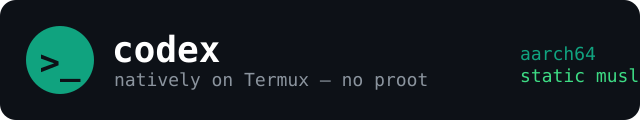

<p align="center">
  
</p>
<p align="center">OpenAI Codex CLI, running natively on Termux. No proot.</p>
<p align="center">
  <a href="https://www.npmjs.com/package/codex-termux"></a>
  <a href="LICENSE"></a>
  
  
</p>

---

### Requirements

- **Termux** from [F-Droid](https://f-droid.org/) (Play Store builds are outdated)
- **aarch64 (ARM64)** device — the only architecture Codex ships a Linux build for
- An internet connection for the ~85 MB download
- `nodejs` (installed automatically if missing — needed for the DNS proxy)

### Installation

**One line — zero prerequisites:**

```bash
curl -fsSL https://raw.githubusercontent.com/rexroze/codex-termux/main/install.sh | sh
```

**Or via npm** (needs nodejs first):

```bash
pkg install nodejs-lts
npm i -g codex-termux
```

> [!TIP]
> `codex` is on your PATH immediately — the first run downloads the
> official static-musl binary (~85 MB), verifies its sha256 checksum, and
> configures your shell (bash, zsh, or fish).

### Usage

```bash
codex login          # or: export OPENAI_API_KEY=...
codex
```

The launcher starts a tiny local DNS proxy on demand (Android has no
`/etc/resolv.conf`, which would otherwise break codex's DNS lookups) and
points codex at Termux's CA bundle for TLS.

### Updating

Updates are **manual by design** — the update check on startup is disabled
(`check_for_update_on_startup = false` in `~/.codex/config.toml`), so new
upstream releases don't get pulled automatically. When a new Codex version
ships, re-run the installer:

```bash
sh install.sh        # or the curl one-liner again — always fetches latest
```

Pin a specific version with `sh install.sh -v rust-v0.148.0`. `codex update`
is intentionally not the supported path (it fetches builds outside this
verified install).

### How it works

Codex ships as a fully static musl binary — it runs on Termux directly, no
glibc bridge. Two Termux-specific problems are solved by the launcher:

1. **DNS**: Android's `/etc` is `/system/etc` (read-only, no `resolv.conf`),
   so the static binary's DNS lookups fail. The launcher starts a local HTTP
   proxy (Node) that resolves hostnames through Android's own resolver and
   routes codex through it via `HTTPS_PROXY`.
2. **TLS**: the static binary can't find Android's CA store, so the launcher
   sets `SSL_CERT_FILE=$PREFIX/etc/tls/cert.pem`.

A first-run `~/.codex/config.toml` sets `sandbox_mode =
"danger-full-access"` (codex's bubblewrap sandbox can't run on Android) and
`check_for_update_on_startup = false`. Full technical deep dive:
[docs/HOW-IT-WORKS.md](docs/HOW-IT-WORKS.md).

### Links

- [docs/FAQ.md](docs/FAQ.md) — shell setup, upgrading, troubleshooting
- [docs/HOW-IT-WORKS.md](docs/HOW-IT-WORKS.md) — technical deep dive
- [codex](https://github.com/openai/codex) — upstream project
- [LICENSE](LICENSE)